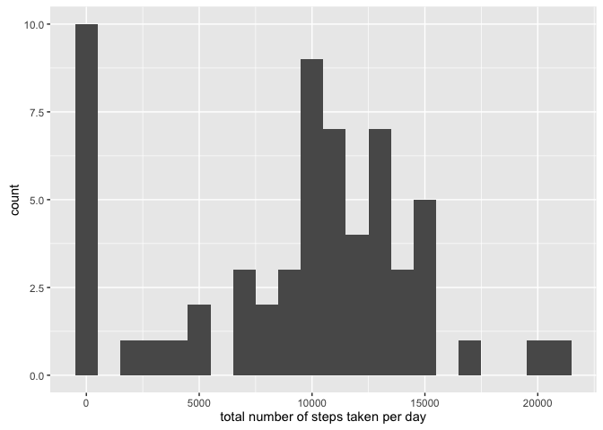
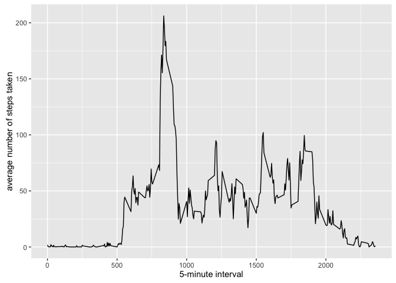
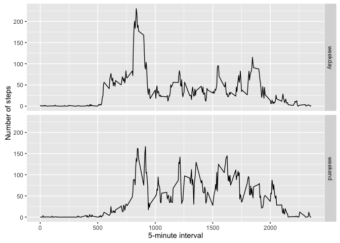

    setwd('/Users/emmasun/Desktop/data science/reproducible research')
    library(ggplot2)
    library(lattice)
    knitr::opts_chunk$set(echo = TRUE)

Loading and preprocessing the data
----------------------------------

Load the data

    rawdata <- read.csv("activity.csv")

What is mean total number of steps taken per day?
-------------------------------------------------

### 1.Calculate the total number of steps taken per day

    total_steps <- tapply(rawdata$steps, rawdata$date, FUN=sum, na.rm=TRUE)

### 2.Make a histogram of the total number of steps taken each day

    histogram(total_steps, breaks = 50, col = "green", xlab="total number of steps taken per day", ylab = "Frenquency", main = "Histogram of total steps")

### 3.Calculate and report the mean and median of the total number of steps taken per day

    mean(total_steps, na.rm=TRUE)

    ## [1] 9354.23

    median(total_steps, na.rm=TRUE)

    ## [1] 10395

What is the average daily activity pattern?
-------------------------------------------

    Aver <- aggregate(x=list(steps=rawdata$steps), by=list(interval=rawdata$interval), FUN=mean, na.rm=TRUE)

### 1.Make a time series plot of the 5-minute interval (x-axis) and the average number of steps taken, averaged across all days (y-axis)

    plot(Aver, type = 'l', col = "green", xlab = "5-minute interval", ylab = "average number of steps taken", main = "Time series")

### 2.Which 5-minute interval, on average across all the days in the dataset, contains the maximum number of steps?

    Aver[which.max(Aver$steps),]

    ##     interval    steps
    ## 104      835 206.1698

Imputing missing values
-----------------------

    missing <- is.na(rawdata$steps)

### 1.the total number of missing

    table(missing)

    ## missing
    ## FALSE  TRUE 
    ## 15264  2304

### 2.Replacemissing values withmean value of its 5-minute interval

    subti_value <- function(steps, interval) {
      filled <- NA
      if (!is.na(steps))
        filled <- c(steps)
      else
        filled <- (Aver[Aver$interval==interval, "steps"])
      return(filled)
    }
    filled_data <- rawdata
    filled_data$steps <- mapply(subti_value, filled_data$steps, filled_data$interval)

### 3.The impact of imputing missing data on the estimates of the total daily number of steps?

    total_steps <- tapply(filled_data$steps, filled_data$date, FUN=sum)
    histogram(total_steps, breaks = 50, col = "green", xlab = "Step/day", ylab = "Frequency", main = "new histogram")

    mean(total_steps)

    ## [1] 10766.19

    median(total_steps)

    ## [1] 10766.19

Answer: Mean and median values are higher after imputing missing data.
The reason is that after replacing missing steps values with the mean
steps of associated interval value, these 0 vaalues set by default
because of those NAs are removed from the histogram of total number of
steps taken each day.

Are there differences in activity patterns between weekdays and weekends?
-------------------------------------------------------------------------

    weekday_or_weekend <- function(date) {
      day <- weekdays(date)
      if (day %in% c("Monday", "Tuesday", "Wednesday", "Thursday", "Friday"))
        return("weekday")
      else if (day %in% c("Saturday", "Sunday"))
        return("weekend")
      else
        stop("invalid date")
    }
    filled_data$date <- as.Date(filled_data$date)
    filled_data$day <- sapply(filled_data$date, FUN=weekday_or_weekend)

    Aver <- aggregate(steps ~ interval + day, data=filled_data, mean)
    ggplot(Aver, aes(interval, steps)) + geom_line() + facet_grid(day ~ .) + xlab("5-minute interval") + ylab("Number of steps")

